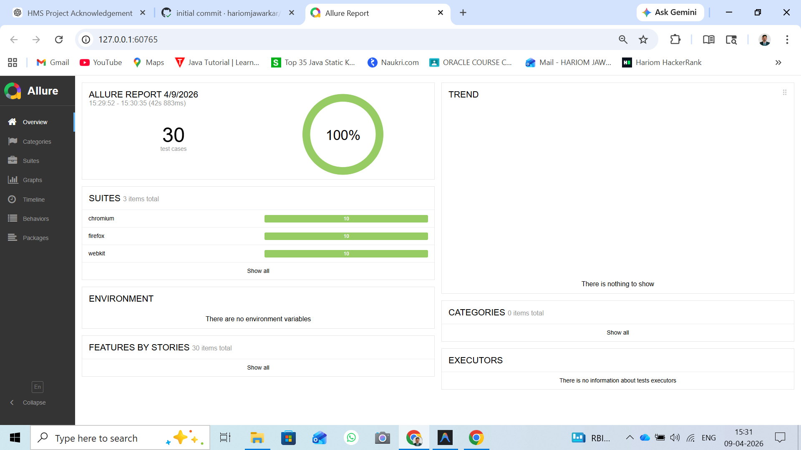
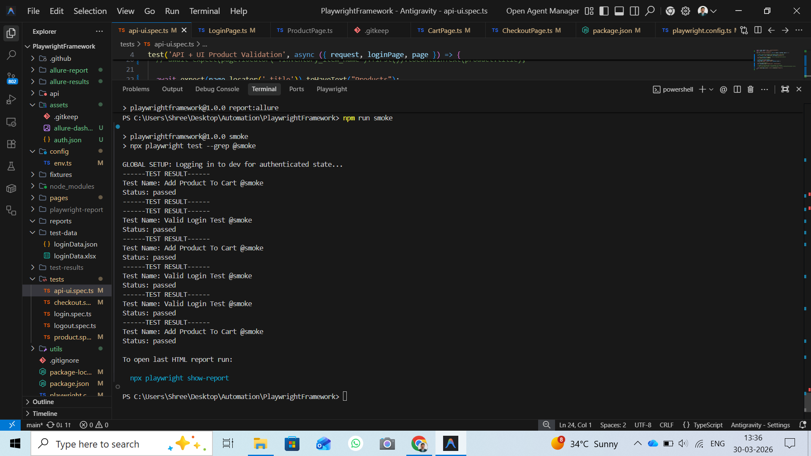
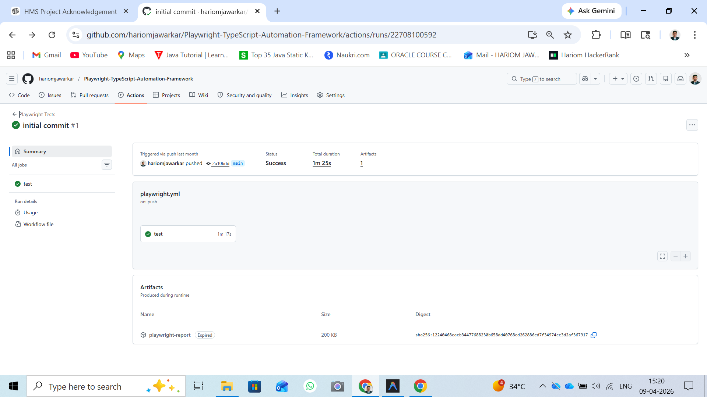

# Playwright TypeScript Automation Framework 🚀

A professional, industrial-grade test automation framework built with **Playwright** and **TypeScript**. This framework is designed for scalability, reliability, and high-performance testing of modern web applications.

---

## 🏗️ Architecture & Features

This framework implements several best practices in test automation:

*   **Page Object Model (POM):** Ensures reusable and maintainable codebase.
*   **Fixtures & Hooks:** Custom Playwright fixtures for clean test setup and teardown.
*   **🖼️ Visual Regression Testing:** Demonstrate pixel-by-pixel UI consistency with native `toHaveScreenshot()` support.
*   **🌍 Dynamic Environment Management:** Capability to run tests against **Dev, Stage, or Prod** via a single CLI command using `cross-env`.
*   **🔑 Global Authentication State:** Optimized test execution by logging in **once** via `global-setup` and reusing the session across all tests.
*   **Dual-Layer Testing:** Comprehensive coverage for both **UI** and **API** end-to-end scenarios.
*   **Data-Driven Testing:** Seamless integration with **Excel (.xlsx)** and **JSON** for test data management.
*   **⏱️ Professional Logging:** Custom logger with **ISO timestamps** for high-transparency debugging.

*   **Advanced Reporting:** 
    *   📊 **Allure Reports** for rich, interactive execution history.
    *   📑 **Playwright HTML Reports** for localized debugging.

*   **CI/CD Ready:** Pre-configured GitHub Actions workflow for automated regression on push/pull requests.
*   **Cross-Browser Testing:** Configured to run on Chromium, Firefox, and WebKit (Safari).

---

## 📊 Framework Results & Execution

### Allure Reporting Dashboard


### Automated Test Execution


### GitHub Actions Pipeline



## 📂 Project Structure

```text
├── .github/workflows/      # CI/CD pipelines (GitHub Actions)
├── api/                    # API-specific test suites
├── config/                 # Environment and global configurations
├── fixtures/               # Playwright custom fixtures
├── pages/                  # Page Object Model classes
├── test-data/              # Test data files (JSON, XLSX)
├── tests/                  # UI and End-to-End test suites
├── utils/                  # Common utilities (Logger, ExcelReader)
├── playwright.config.ts    # Main Playwright configuration
└── package.json            # Project dependencies and scripts
```

---

## 🛠️ Prerequisites

*   **Node.js:** v18.0.0 or higher
*   **npm:** v9.0.0 or higher

---

## 🚀 Getting Started

### 1. Clone the repository
```bash
git clone https://github.com/hariomjawarkar/Playwright-TypeScript-Automation-Framework.git
cd Playwright-TypeScript-Automation-Framework
```

### 2. Install dependencies
```bash
npm install
```

### 3. Install Playwright Browsers
```bash
npx playwright install
```

---

## 🐳 Docker Execution

This framework is fully containerized to ensure 100% environment parity across Dev, QA, and CI environments.

### 1. Build the Docker Image
```bash
npm run docker:build
```

### 2. Run Tests in Container
```bash
npm run docker:run
```
*Note: This will execute the tests inside a Linux container and sync the results back to your local `allure-results` folder.*

---

### 🧪 Execution Commands

| Environment | Command |
| :--- | :--- |
| **Development** | `npm run test:dev` |
| **Staging** | `npm run test:stage` |
| **Production** | `npm run test:prod` |
| **Smoke Suite** | `npm run smoke` |
| **Visual Registry** | `npx playwright test --grep @visual` |

### 📊 Reporting

| Report Type | Command | Description |
| :--- | :--- | :--- |
| **HTML Report** | `npm run report:html` | Standard Playwright HTML reporter |
| **Allure Report** | `npm run report:allure` | Professional dashboard with trends |


---

## 🤖 CI/CD Integration

The project includes a `.github/workflows/playwright.yml` file which automatically:
1. Installs dependencies.
2. Installs browsers.
3. Executes the full test suite.
4. Uploads reports as artifacts on every push to the `main` branch.

---

## 👨‍💻 Author
**Hariom Jawarkar**
- GitHub: [@hariomjawarkar](https://github.com/hariomjawarkar)
